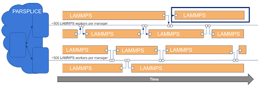
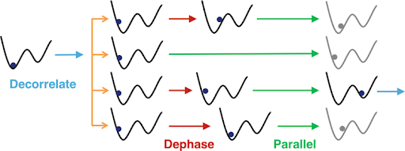

# 0. Materials by Design Overview
A fundamental challenge for molecular dynamics (MD) simulation is to propagate the dynamics for a sufficiently long simulated time to sample all of the relevant molecular configurations.  Historical MD workflows have therefore consisted of long-running jobs (or sequences of jobs), where each time-step may be accelerated by disributing atoms across parallel processing units, but the series of time-steps progresses sequentially. Recent advances in MD sampling effectivly provide route to parallelize the time dimension of the simulation as well.  

EXAALT is an ECP project aimed at enabling long-timescale MD through a combination of software optimization to enable excellent performance on exascale architectures and the advanced sampling methods mentioned above. 
One of the possible EXAALT workflows uses ParSplice to manage multiple instances of the LAMMPS MD engine.




An individual LAMMPS job is relatively brief, and ParSplice provides a hierarchical task management layer that uses physics-based criteria to select which configurations to in order to efficiently explore the potential energy survace.  More information about EXAALT, ParSplice and LAMMPS can be found at:
- EXAALT:    https://www.exascaleproject.org/research-project/exaalt/
- ParSplice: https://doi.org/10.1021/acs.jctc.5b00916
- LAMMPS:     https://doi.org/10.1016/j.cpc.2021.108171 

The Materials by Design workflow benchmark is based on  the ParSplice +  LAMMPS workflow, 
but the ParSplice workflow engine is not involved in the benchmark because it would add significant complexity in compiling, running and performance analysis of the simulations.  Instead, the benchmark consists of a single run of the LAMMPS MD package, which is the performance critical component of the workflow, typically using over 95% of the EXAALT runtime. The benchmark problem simulates the high-pressure BC8 phase of carbon using the Spectral Neighbor Analysis Potential (SNAP). LAMMPS's highly optimized implementation of the SNAP potential was written using the Kokkos portability layer, as described in: https://doi.org/10.1145/3458817.3487400

# 1. Code Access and Compilation Details
The process of building the EXAALT benchmark has three basic steps: obtaining the source code, configuring the build system, and compiling the source code.   All of these steps are performed by the `build_lammps_KNL.sh`, `build_lammps_V100.sh` and `build_lammps_PM.sh` scripts; these are suitable for building on NERSC's Cori, Cori-GPU and Perlmutter systems and can be used as templates to guild the build process on other systems.

## 1.1 Obtaining LAMMPS source code
The following three commands will clone the stable branch of LAMMPS from version 23 June 2022. This is the required version for baseline runs of the benchmark. Optimized runs may use custom code or newer versions of LAMMPS, but NERSC supports only the tested version.
```console
    git clone --single-branch --branch master https://github.com/lammps/lammps.git
    cd lammps
    git checkout 7d5fc356fe
```

## 1.2 Configuring the LAMMPS build system
LAMMPS uses the CMake tool to configure the build system and generate the makefiles.
From within the `lammps` directory, run the CMake commands
that is most appropriate for your compute architecture.
The example below is suitable for generic Linux workstation without a GPU accelerator.
```
cmake -D CMAKE_INSTALL_PREFIX=$PWD/../install_gcc/ \
      -D CMAKE_CXX_COMPILER=g++ \
      -D CMAKE_Fortran_COMPILER=gfortran \
      -D BUILD_MPI=yes \
      -D MPI_CXX_COMPILER=mpicxx \
      -D PKG_USER-OMP=ON \
      -D PKG_KOKKOS=ON \
      -D DOWNLOAD_KOKKOS=ON \
      -D Kokkos_ARCH_FIXME=ON \
      -D PKG_SNAP=ON \
      -D CMAKE_POSITION_INDEPENDENT_CODE=ON \
      -D CMAKE_EXE_FLAGS="-dynamic" \
      ../cmake
```
Examples for NERSC's Cori-KNL and Perlmutter (GPU) systems can be found in the build_lammps_KNL.sh and build_lammps_PM.sh scripts.
More cmake options that may be useful when customizing for other systems/architectures can be found in chapter 3 of the LAMMPS User Guide: https://lammps.sandia.gov/doc/Build.html.


## 1.3  Building LAMMPS
The build scripts configure, build and install the lammps library in the repo's main directory path. The following commands will compile LAMMPS and install the executable at `lammps/install_ARCH/bin/lmp`.
```console
make
make install
```
For convenience in later steps (when running the benchmark), you may want to create links to the executables in the LAMMPS_benchmarks directory:
```console
cd ../LAMMPS_benchmarks
ln -s ../lammps/install_knl/bin/lmp  ./lmp_knl
```

# 2. Running the benchmark

Input files and batch scipts for seven (7)  problem sizes are provided in the benchmarks directory.
NERSC-10 RFP responses should provide results (measured or projected) for the "xlbench" problem size.
SSI reference values from NERSC's Perlutter system were evaluated using the "large" problem size.
Other problem sizes  have been provided as a convenience,
to facilitate profiling at different scales (e.g. socket, node, blade or rack),
and extraplation to larger sizes.
The collection of problems form a weak scaling series
where each successively larger problem simulates eight times as many atoms as the previous one.
Computational requirements are expected to scale linearly with the number of atoms.
The following table lists the approximate system resoures
needed to run each of these jobs on Perlmutter.

|Index | Size    |  #atoms |    C            |  #PM nodes | Total Mem(GB) | #time(sec) |
|----- | ----    |  ------ | ------          | ---------- | ------------- | ---------  |
|0     | nano    |     65k |  8<sup>-5</sup> |    0.25    |      0.14     |      3     |
|1     | micro   |    524k |  8<sup>-4</sup> |    0.25    |      0.23     |     25     |
|2     | tiny    |   4.19M |  8<sup>-3</sup> |       1    |      1.33     |     54     |
|3     | small   |   33.6M |  8<sup>-2</sup> |       1    |      7.32     |    424     |
|4     | medium  |   268.M |      0.125      |       8    |      58.6     |    405     |
|5     | large   |   2.15B |       1         |      32    |      453.     |    853     |
|6     | xlbench |   17.2B |       8         |     N/A    |     3700 (est)|    N/A     |

Each problem has its own subdirectory within the benchmarks directory.
Within those directories, the run_<size>_A100.sh script shows
how the jobs were executed on Perlmutter. 

The essential  steps are to
1. add a link to the data that are common to all problem sizes: `ln -s ../../common`
2. load the size-specific simulation parameters into the BENCH_SPEC variable: `source <size>_spec.txt`
3. run the job: `srun -n #ranks  /path/to/lammps/lmp  <lammps_options>  ${BENCH_SPEC}
The recommended lammps_options for Perlmutter (and similar systems) are:
"-k on g 1 -sf kk -pk kokkos newton on neigh half" 

# 3. Results

## 3.1 Correctness
Correctness can be verified by comparing the total energy per unit cell after 100 time-steps
to the expected value on computed on Perlmutter ( -8.7467391 ).
The relevant energy measurement can be extracted by the command
```grep '       100' lammps.out | awk '{print $5}'```
The tolerance for the relative error is a function of the problem size
and is more strict for larger problems.
The `validate.py` script is provided to perform the comparison.
```
$ validate.py --help
| validate.sh: test output correctness for the NERSC-10 LAMMPS benchmark.
| Usage: validate.sh <output_file>
|
$ validate.py lmp_nano.out
| Found size: 0_nano
| Validation: PASSED
| LAMMPS_walltime(sec): 3.14565
```

## 3.2 Figure of Merit
The Figure of Merit is the walltime of the job,
and can found in the LAMMPS output:
grep "Loop time:" which gives the time taken to simulate a loop in seconds.
It is also printed by `validate.py`.

The reported FOM values must be paired with a description of the (i.e. node-type and node-count) used to acheive the FOM.

## 3.3 Figure of Merit

The figure of merit (FOM) in this case is the throughput of LAMMPS application that can be computed from the walltime of the job. LAMMPS walltime can be found in its output, you can just grep "Loop time:" which gives the time taken to simulate a loop in seconds. It is also printed by `validate.py`. Throughput can be computed as follows:

- The application throughput for each node type is ( c * Total_Nodes) / ( Nodes_Used * Walltime).
- Summing over node types give the total throughput of the application. In this case we just have one node type.

<!-- This FOM can be optimized by minimizing the resources (e.g. node-hours) used by each application / node-type pair. -->
A sample FOM calculation is illustrated in the following table.
This example uses timing measurements for the large problem (c=1.0) on NERSC's Perlmutter system (GPU nodes).
Responses should provide timing and FOM esimates for the extra large problem size (17.2B atoms) (c=8.0) on the proposed system. 

| Application | Node<br>Type | Total<br>Nodes | Nodes Used <br> per Job | Walltime<br>(sec) |  Application<br>Throughput<br>(jobs/hour) | Workflow<br>Throughput<br>(&lt;flows/hour&gt;) | 
| ---         | :---:        | :---:          | :---:                   | :---:             | :---:                                     |:---:                                    |
| **Epsilon** | PM-GPU       |  1536         | 128                     |  853          |  50.84                                   |                                         |
|             | Total        |                |                         |                   |  **50.84**                                | &#8628;                                 |
| **FOM**     |              |                |                         |                   |                                           | **50.84**                               |


## 3.3 Reporting
For the electronic submission, include all the source and makefiles used to build on the target platform and input files and runscripts. Include all standard output files.


